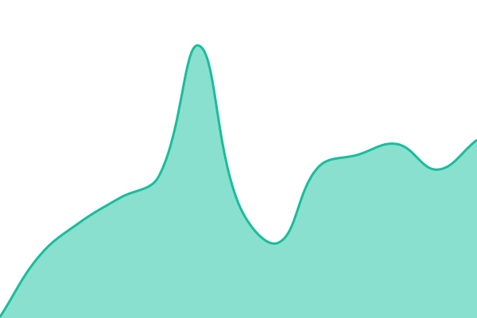
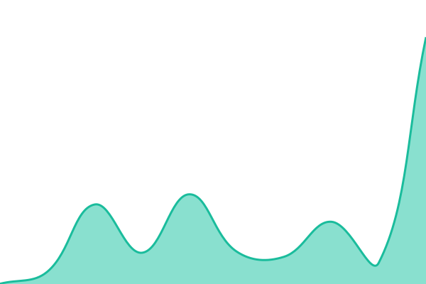

# [📈 Live Status](https://status.sitemark.in): <!--live status--> **🟧 Partial outage**

This repository contains the open-source uptime monitor and status page for [Manpreet Singh](https://status.sitemark.in), powered by [Upptime](https://github.com/upptime/upptime).

With [Upptime](https://upptime.js.org), you can get your own unlimited and free uptime monitor and status page, powered entirely by a GitHub repository. We use [Issues](https://github.com/iammanpreetbhullar/sitemark-status/issues) as incident reports, [Actions](https://github.com/iammanpreetbhullar/sitemark-status/actions) as uptime monitors, and [Pages](https://status.sitemark.in) for the status page.

<!--start: status pages-->
<!-- This summary is generated by Upptime (https://github.com/upptime/upptime) -->
<!-- Do not edit this manually, your changes will be overwritten -->
<!-- prettier-ignore -->
| URL | Status | History | Response Time | Uptime |
| --- | ------ | ------- | ------------- | ------ |
|  [Dashboard](https://beta.sitemark.in) | 🟩 Up | [dashboard.yml](https://github.com/iammanpreetbhullar/sitemark-status/commits/HEAD/history/dashboard.yml) | 

 168ms
     
 | 

<a href="https://status.sitemark.in/history/dashboard">100.00%</a>
    

|  [API](https://sitemark-api-179761712596.us-central1.run.app/health) | 🟩 Up | [api.yml](https://github.com/iammanpreetbhullar/sitemark-status/commits/HEAD/history/api.yml) | 

 59ms
     
 | 

<a href="https://status.sitemark.in/history/api">100.00%</a>
    

|  [Database](https://sitemark-api-179761712596.us-central1.run.app/health/ready) | 🟥 Down | [database.yml](https://github.com/iammanpreetbhullar/sitemark-status/commits/HEAD/history/database.yml) | 

 52ms
     
 | 

<a href="https://status.sitemark.in/history/database">2.91%</a>
    

|  [Realtime](https://ws.sitemark.in/health) | 🟩 Up | [realtime.yml](https://github.com/iammanpreetbhullar/sitemark-status/commits/HEAD/history/realtime.yml) | 

 511ms
     
 | 

<a href="https://status.sitemark.in/history/realtime">100.00%</a>
    

|  [Extension sync](https://beta.sitemark.in/api/proxy/health/ready) | 🟥 Down | [extension-sync.yml](https://github.com/iammanpreetbhullar/sitemark-status/commits/HEAD/history/extension-sync.yml) | 

 229ms
     
 | 

<a href="https://status.sitemark.in/history/extension-sync">3.01%</a>
    

<!--end: status pages-->

[**Visit our status website →**](https://status.sitemark.in)

## 📄 License

- Powered by: [Upptime](https://github.com/upptime/upptime)
- Code: [MIT](./LICENSE) © [Anand Chowdhary](https://anandchowdhary.com)
- Data in the `./history` directory: [Open Database License](https://opendatacommons.org/licenses/odbl/1-0/)
